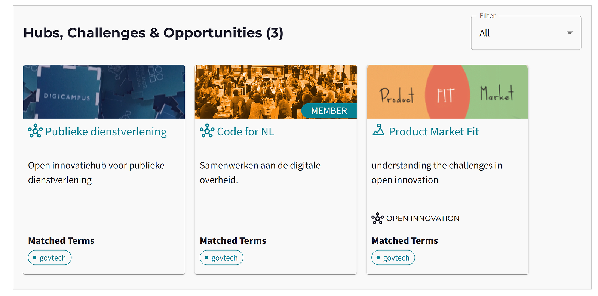
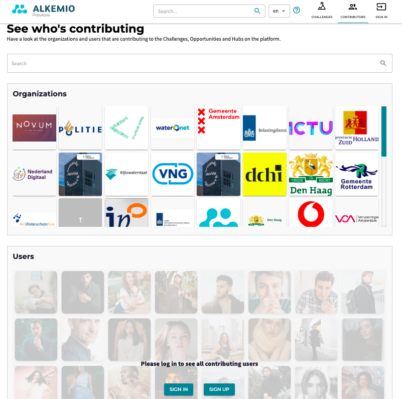
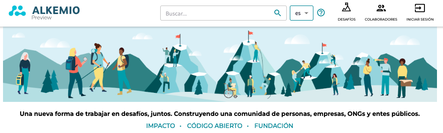
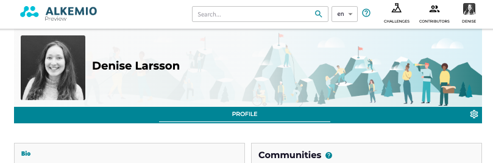
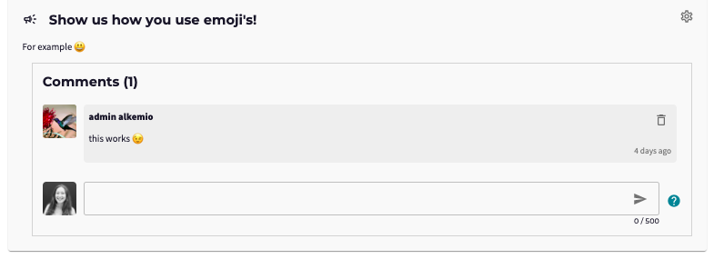

---
# An instance of the Blank widget.
# Documentation: https://wowchemy.com/docs/page-builder/
widget: blank

# This file represents a page section.
headless: true

# Order that this section appears on the page.
weight: 1

# Section title
title: Alkemio Release Notifications

# Section subtitle
subtitle: 

# Section design
design:
  # Use a 1-column layout
  columns: "1"
  spacing:
    # Customize the section spacing. Order is top, right, bottom, left.
    padding: ['30px', '0px', '0px', '0px']
  # Use a dark navy background with light text.
  #background:
  #  color: 'navy'
  #  text_color_light: true
---
Alkemio makes updates to the production platform approximately every two weeks. Below you can find the latest release note as well as links to previous notes.

<b>Release 2022-09-28</b>

<i>Most of the improvements in the release are again related to user engagement: search refresh, contributors page refresh, translation updates, and ... emoji's 😀.</i>

#### Search User Experience

As a User I want to find content on the platform easily. 

Our previous search page still included an old design and was therefore in need of a good refresh... so the <u>[search page](https://alkem.io/search?utm_source=hs_email&utm_medium=email&utm_content=64508637&_hsenc=p2ANqtz-9flNzEbc0S7uJQ3Nf5i34zKSG029nPsS5YU2FhnqukY8iyK6_dAbrF4cg-ysgqnZLCzODpCImke1Nk71Qs-djoUQf5VQ)</u> was a key focus the previous sprint. Highlights:
- <b>Search cards</b>: each result now has a fresh new card to show what was matched
- <b>Display of results</b>: Results are grouped by type: Journeys (Hubs / Challenges / Opportunities) and Contributors (Users / Organizations)

#### Contributors Page

As a User I want to easily be able to browse through the Contributors on the platform.

When clicking on the <u>[Contributors page](https://alkem.io/contributors?utm_source=hs_email&utm_medium=email&utm_content=64508637&_hsenc=p2ANqtz-9flNzEbc0S7uJQ3Nf5i34zKSG029nPsS5YU2FhnqukY8iyK6_dAbrF4cg-ysgqnZLCzODpCImke1Nk71Qs-djoUQf5VQ)</u>, you want to <b>immediately see</b> some users and organizations. The old design only showed them after searching. In the refreshed design you can easily search for, and scroll through, all contributors.

Keep in mind that users are only visible after logging in!

#### Translations: Spanish (new!), Dutch

Alkemio recently participated in an event in Málaga to discuss how technology can support open and collaborative communities. An interesting reason to add a <b>new language</b> to our platform!

Credits to our team member Carlos from Madrid! 

Also for our innovators in the Netherlands, we have carried out a significant update to the <b>Dutch translations</b>! 

#### User and Organization profile banners

A small update to the user and organization banners, that now include a transparent <b>Alkemio banner</b> instead of the full banner or a white background.

#### Support of emoji's

And last but not least, some fun 😉 The Alkemio platform now supports the use of emoji's.

Available in comments, updates, describing your challenge etc - bring some more emotions into the description!

So a bunch of visible enhancements in this release, glad as always to hear any feedback on the above updates. Enjoy!
