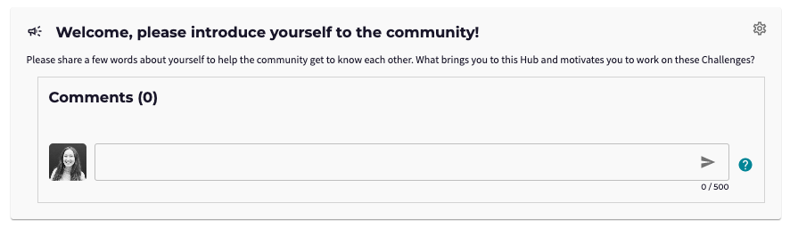
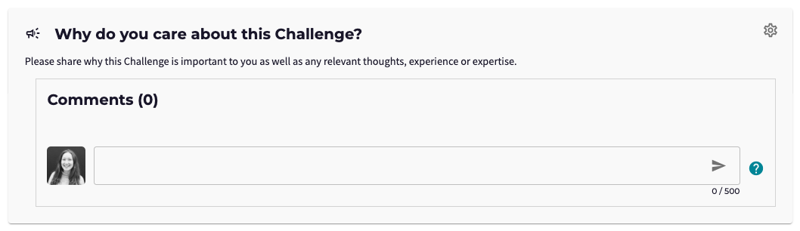
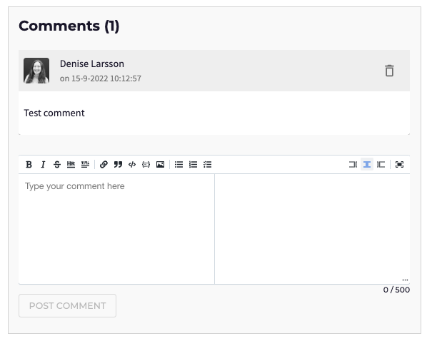
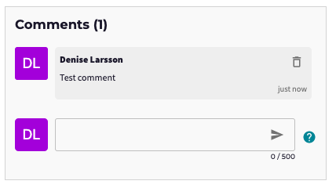
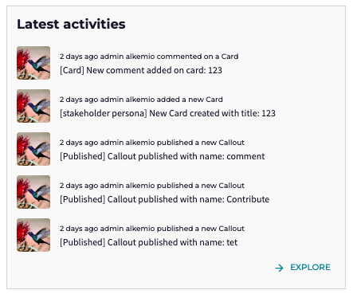
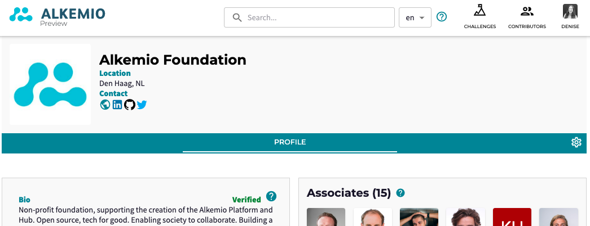

---
# An instance of the Blank widget.
# Documentation: https://wowchemy.com/docs/page-builder/
widget: blank

# This file represents a page section.
headless: true

# Order that this section appears on the page.
weight: 1

# Section title
title: Alkemio Release Notifications

# Section subtitle
subtitle: 

# Section design
design:
  # Use a 1-column layout
  columns: "1"
  spacing:
    # Customize the section spacing. Order is top, right, bottom, left.
    padding: ['30px', '0px', '0px', '0px']
  # Use a dark navy background with light text.
  #background:
  #  color: 'navy'
  #  text_color_light: true
---
All,

The 2022-09-15 release went to production yesterday!

Most of the improvements are again related to user engagement: simpler Comments, Discussion Callout and the displaying of Activity in communities.

The enhancements that users will experience include: 

### Discussion Callout

As an Admin, I want to be able to engage the Community, and as a User I want to be easily able to contribute.
 
In the previous release, we introduced <b>Callouts</b> as a core concept for engaging the Community. That release came with Callouts for Cards and Canvases. However the Callout concept is designed to be very flexible - and in this release we introduce a third Callout type: <b>Discussions</b>!

Members of the Community can contribute by replying with a <b>simple text</b>. For example, community members can introduce themselves, share relevant thoughts on a topic etc.

A <i>draft</i> Discussion Callout has been added to each Hub and each Challenge. As an Admin you can then edit the wording if you wish and choose to publish it to your Community (or delete it).

The draft Callout on a <b>Hub</b> asks members to introduce themselves to the rest of the Community:

The draft Callout on a <b>Challenge</b> asks members to share their first thoughts, experience and expertise with others!

### Comments

As a User I want to be easily able to Contribute, via a simple interface.

From the Discussion Callout images above, you can spot another update: the refresh of the comments interface. Previously, placing a comment on an Aspect had a really "heavy" interface with a lot of (often) unnecessary functionalities to choose from (left). This is now much <b>simpler</b>, but still supports markdown formatting, such as bold, italic, links (right). 

### Latest activities

As a user I want to see what is happening in a Community. This is now directly available :)

Each Dashboard tab now has a first version of a <b>timeline feed with activities</b>. If someone adds a Card, a new Callout is published, a new member joins etc - you can see all that now directly on the activity feed:

### User and Organization profile banners

As a User I want to be able to see information about Users and Organizations that are Contributing. And I want that my profile looks great!

The profile page for Users and Organizations has been refreshed to display key information in the Banner:

### Email Notifications

As a User I want to be notified of what is happening in my Communities. This has been supported via Notification emails for a long time - but has been extended in this release. A new notification email for when a <b>Callout is published</b> has been added.

In addition, the titles and contents of the notification emails have been updated. For example, the <b>community name</b> now always comes first to make it easy for you to see what is happening in which community!

So a bunch of visible enhancements in this release, glad as always to hear any feedback on the above updates. Enjoy!