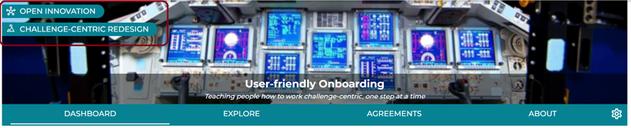
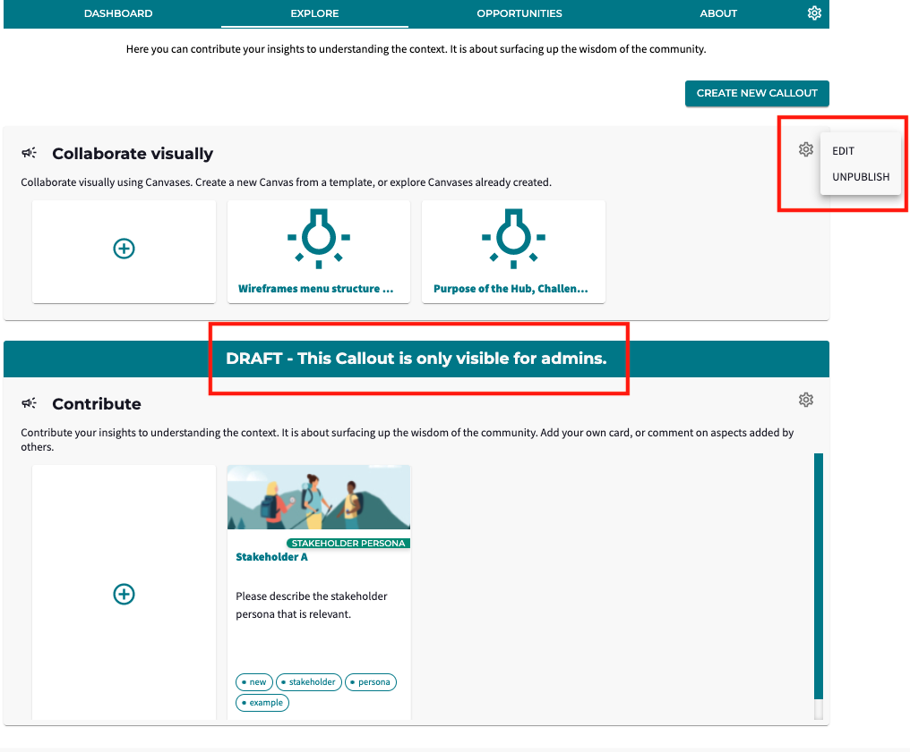
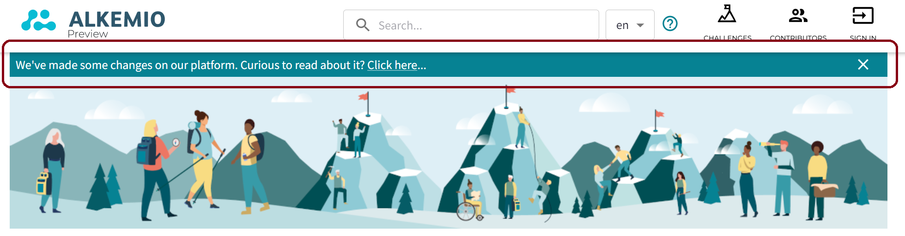

---
# An instance of the Blank widget.
# Documentation: https://wowchemy.com/docs/page-builder/
widget: blank

# This file represents a page section.
headless: true

# Order that this section appears on the page.
weight: 1

# Section title
title: Alkemio Release Notifications

# Section subtitle
subtitle: 

# Section design
design:
  # Use a 1-column layout
  columns: "1"
  spacing:
    # Customize the section spacing. Order is top, right, bottom, left.
    padding: ['30px', '0px', '0px', '0px']
  # Use a dark navy background with light text.
  #background:
  #  color: 'navy'
  #  text_color_light: true
---
Alkemio makes updates to the production platform approximately every two weeks. Below you can find the latest release note as well as links to previous notes.

<b>Release 2022-8-26</b>

<i>This is a major release. It simplifies hugely the user experience, brings key new functionality such as Callouts and Innovation Flows, improves mobile navigation and much more. These changes are all part of our drive to increase user engagement.</i>

- <b>Platform menu</b>: Platform level pages such as the Challenges and Contributors pages are now accessed via icons top right. For Admins, the platform level administration is now available via your profile. This allowed us to remove the previous platform menu bar: 

- <b>Hub / Challenge / Opportunity Navigation</b>: the *banner* for Hub, Challenge, and Opportunity now becomes a banner across the page with the title and tagline centered. If you are on Challenge or Opportunity level, you can also navigate back to the parent Hub or Challenge level via the *labels* top left. 

- <b>Hub / Challenge / Opportunity Tabs</b>: The set of tabs are reduced from six to four:
    - The *Dashboard* tab has mostly remained the same, including a summary of the content.
    - The *Explore* tab becomes the place where all the wisdom of the community is gathered, supporting multiple Callouts containing Canvases or Aspects. 
    - The *Challenges* and *Opportunities* tabs have remained the same.
    - The *About* tab now contains all information from the former Context and Community tabs.

  Finally, the <b>administration</b> is now done in the context of the containing entity. This can be reached via the cogwheel icon on the right. Note that it is now possible to directly navigate back to different areas of a Hub / Challenge / Opportunity from within the settings.

- <b>Callouts</b>: Callouts are a core new platform concept to engage the Community. 
    - Previously, your Community was able to share their knowledge via Aspects or Canvases. But this approach did not allow for *providing context to the request* to the Community, nor to have multiple requests to the Community.
    - With the addition of Callouts, admins can frame *multiple requests* to the Community on different topics. The Community can answer by submitting a Card (previously known as Aspects) or Canvas.
    - Also, you can keep your Callout in <i>draft</i> (only visible to admins) or <i>publish</i> it (also visible for your community). The cogwheel on the right allows you to publish/unpublish as well as <i>edit</i> your Callout. 
- <b>Innovation Flows</b>: 'Innovation Flows' are another new core platform concept! They encapsulate the set of phases that a Challenge or Opportunity goes through as it progresses.

The platform also now supports <b>'Innovation Flow Templates'</b>. These are best practice Innovation Flows that can be used throughout the Hub. They are available via the Templates tab on the settings for a Hub. 
  <i>The creation of new Innovation Flow Templates is one that for now should be done with our assistance, but we would love to work with you to get your best practices available to your Community!</i>
  
  The Innovation Flow Templates are then available to admins when creating a new Challenge or Opportunity:
  
Innovation Flows, and the related Innovation Flow Templates, are core platform functionality that has been there since the first version of Alkemio - so it is great to start exposing this to our Community. We would love to hear your feedback on this!!
- <b>Mobile Menu</b>: also, we have refreshed the navigation for your mobile device:

- <b>Release Notifications</b>: and finally, when new releases are deployed, users will now see a <i>Release Notification banner</i> to inform them both that the release has happened as well as where they can find additional information about what has changed:

This is all about ensuring the Community is informed about what has changed, certainly when such major updates are made available.
