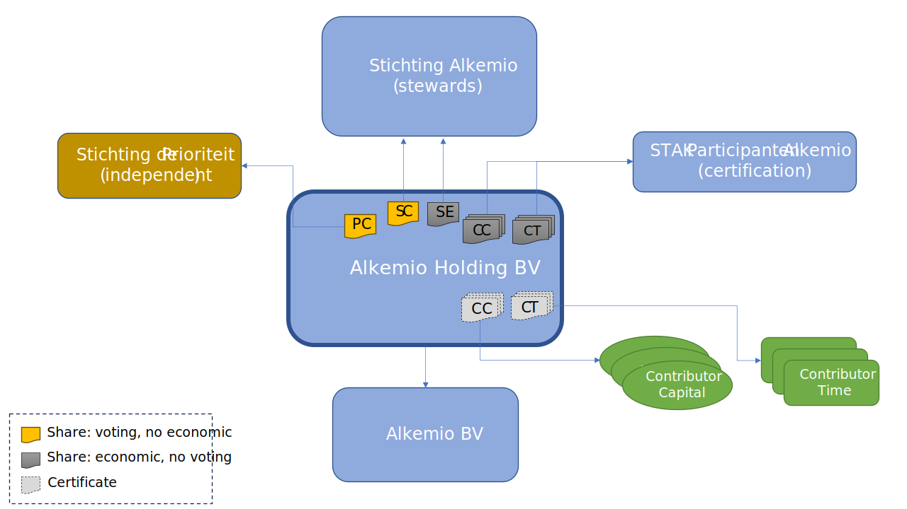

---
# An instance of the Blank widget.
# Documentation: https://wowchemy.com/docs/page-builder/
widget: blank

# This file represents a page section.
headless: true

# Order that this section appears on the page.
weight: 5

# Section title
title: 

# Section subtitle
subtitle: 

# Section design
design:
  columns: '1'
  spacing:
    # Customize the section spacing. Order is top, right, bottom, left.
    padding: ["20px", "0", "30px", "0"]
---
# **Alkemio Group Struture**
This section describes the structure that Alkemio has chosen, including the rational for key choices. 

The implementation is intended to provide a long term foundation for the growth of Alkemio.  

## Background

**Alkemio** is in business to empower society. The purpose of empowering society to solve challenges effectively is at the core of everything we do. We are building a team of employees, partners and investors that share this purpose. Together we are building Alkemio as a profitable and sustainable long-term business to achieve the greatest scale and impact. 

Alkemio offers a broad and ambitious vision, and the Alkemio platform is achieving initial traction in the market. Partners are buying into the vision and purpose of Alkemio, and we are seeing a clear need in the market. However the journey so far is just the start. It is critical that we live up to the expectations of early adopters of the platform, moving from sharing of challenges to significant actual usage by end users of the platform. 

To take the platform to the next level requires significantly increasing the resources available. In particular 
* capital (finance) for investing in the further development of the platform, and 
* top talent to execute the vision. 

It simply is an ambitious vision. 

## Roadmap to Steward Ownership
Stichting Alkemio was established in June 2020, and operated as a single entity until early 2023. It fulfilled multiple roles: supporting both the building of the platform, growing the community and the roadmap for the organization. 

However it was clear that a single entity structure, and in particular a foundation, would not be sufficient to realise the full vision, lacking in three key areas:
* Ability to guarantee the purpose
* Ability to raise capital
* Ability to reward top talent

Enter **Steward Ownership**, where profit serves purpose. It was quickly clear that Steward Ownership, combined with a revised organizational structure, could address all key issues identified. The core features of Steward Ownership, as implemented by Alkemio, to highlight are:
* **Leadership**:  "stewards" guide the venture and are chosen based on capability and alignment with the mission
* **Independent guarantee**: it is possible to issue a share with blocking rights on key provisions to an independent party. 
* **Capped economic returns without control**: allowing sharing of economic returns to both investors and talent, without offering control, while also ensuring that ultimately the value generated goes towards the purpose of Alkemio 

## Group Strucure Entities
The new organizational structure implemented by Alkemio is shown below:

  </a>

It is important to note that **Alkemio Holding** _is_ the Steward Ownership venture. It is a for profit, commercially and professionally run venture. The value generated is distributed in accordance with the principles of Steward Ownership and the purpose of Alkemio. 

The key entities in this diagram and their roles: 
* **Alkemio Holding BV**: the central entity, bringing together all the stakeholders. It is a holding company, raising capital, receiving and distributing profits, holding assets (IP), etc. 
* **Stichting Alkemio**: the original entity, whose role evolves to being the "steward" for Alkemio Holding. The board of Stichting Alkemio are in effect the stewards. 
* **Stichting de Prioriteit**: an independent foundation whose purpose is to hold "golden shares" in steward ownership ventures. It is obliged to act according to the principle of steward ownership. 
* **Alkemio BV**: the operating entity that actually provides the Alkemio services to the market. It is 100% owned by Alkemio Holding. Over time there are likely to be multiple operating companies, depending on the needs of the business.
* **STAK Participanten Alkemio**: manages the conversion of certain classes of Alkemio Holding shares to certificates (so economic rights). It otherwise plays no active role. 

## Alkemio Holding BV share structure
As the core entity in the organizational design, it is important to clarify the different share classes in Alkemio Holding and their purpose. 

* **Steward Control (SC)**: provides the primary voting control. No economic interest. It is a single share, held by Stichting Alkemio.
* **Purpose Control (PC)**: provides the independent guarantee on the purpose of Alkemio Holding. No economic control. It is a single share, held by Stichting de Prioriteit. 
* **Contributor Capital (CC)**: provides for economic participation for investors of capital. No voting control. Converted to certificates via STAK Participanten Alkemio. Economic returns are capped.
* **Contributor Time (CT)**: provides for economic participation for contributors of time. No voting control. Converted to certificates via STAK Participanten Alkemio. Economic returns are capped. 
* **Steward Economic (SE)**: provides for economic value generated to be returned to Stichting Alkemio. No voting control. Economic returns are not capped. 

There are multiple implications from the above structure that are worth detailing out:
* **Separation of control from economic interest**: One interesting aspect of the above design is that it is actually much **simpler** in some ways than more standard share structures. Key is that there is no share class that holds both economic and voting interests. This actually makes the articles and execution of the structure significantly simpler as one can deal with voting control fully separate from economic interest. 
* **One mechanism for allocation of value generated**: All economic value is allocated via the CC / CT / SE shares. There is no partial ownership in the structure i.e. all entities are 100% owned by a parent entity. This is for simplicity, as there is then one mechanism for the allocation of value generated. 
* **Split between SC and SE shares**: Finally, one question that you may ask is why the need for both SC and SE. The rational is that from a steward ownership persepective it is important to decouple the control from the economic interest. However the above is already a heavy organizational structure for the size of Alkemio, so the decision was made to have SE also held by Stichting Alkemio near term - not least as there is not likely to be substantial value flowing to that share near term. And then as the organization grows it is expected that the SE share would ultimately be held by a separate entity, that is mandated to allowed value accruing from the underlying business according to the purpose of Alkemio. 

## PC share = Double Lock on Purpose
The adoption of Steward Ownership can be seen as a **double lock** on the purpose of Alkemio. This is important for two key reasons:
* investors in Alkemio do not have voting shares, so they are fully dependent on the governance that is in place. 
* as Alkemio achieves significant scale, the venture will be highly valuable - so the locks need to be put in place now to prevent any temptation in the future

It is simply a _much stronger_ guarantee than relying on the governance of a Foundation. 

The Purpose Control (PC) share is held by Stichting de Prioriteit, an entity establised also in The Netherlands with the purpose to act as an independent party guaranteeing principles of steward ownership are followed in such ventures.

It is also important to mention again the fact that investors in the above structure do not have formal control. They need to fully rely on the double lock of the foundation and the independent guarantee on purpose to ensure governance and decisions are made in line with the stated purpose. Hence the importance of the double lock. 
