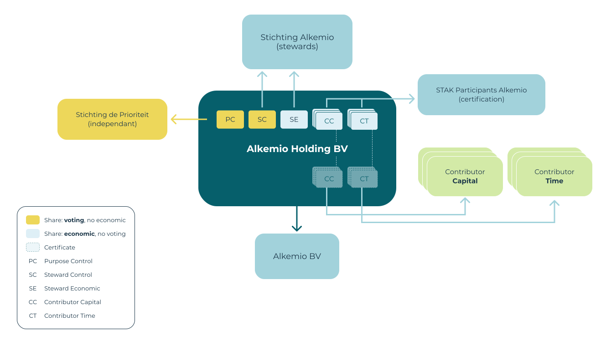

## Alkemio and Steward Ownership

Sharing Alkemio’s journey to keep purpose first while being able to attract the talent and capital to scale the platform. This was not an easy journey, and we hope this will help many other ventures looking to make positive contributions to society!

### Desire to keep purpose first

**Alkemio** is in business to empower society to solve challenges effectively. This purpose is central to everything we do. We are building a team of employees, partners, and investors that share this purpose. To ensure their continued trust and achieve the long-term vision, we have chosen Steward Ownership as the core of our group structure.

Alkemio offers a broad and very ambitious vision, shared by a growing community of partners. The Alkemio platform is achieving traction and we are seeing a clear need in the market. However, the journey so far is just the start. It is critical that we live up to the expectations of early adopters of the platform, with significant usage and impact on society.

Achieving this requires expanding the resources available. In particular:
- Capital for investing in the further development and scaling of the platform
- Top talent to execute the vision

And doing it in the right way, aligned with the purpose.

### Journey to Steward Ownership

Stichting Alkemio was established in June 2020, as a foundation in the Netherlands. It fulfilled multiple roles: building the platform, growing the community and developing the roadmap for the organization. It became clear that a single entity structure, and in particular a foundation, would not be sufficient to scale the platform and realise the full vision.

The drivers for Alkemio were:
- Ability to guarantee the purpose
- Ability to raise capital
- Ability to attract top talent

We knew we had found the solution when we heard about **Steward Ownership**, which we implemented in 2023.

Steward Ownership is a legal structure for companies that places purpose first and where profit serves the purpose. It is around for many years with long-term successful companies such as Bosch and Zeiss, and is now growing in popularity including with Patagonia. It provides a way to raise capital and attract top talent while ensuring the purpose remains to benefit society.

Core features of Steward Ownership, as implemented by Alkemio, include:
- **Leadership**: "Stewards" guide the venture and are chosen based on capability and alignment with the purpose
- **Independent guarantee**: Providing an independent party with blocking rights, to ensure purpose remains central. Approval is required for changing ownership, changing the group structure, modifying the purpose, extracting value not in line with the purpose, excessive remuneration of staff, etc. Full details can be seen in the Alkemio Holding B.V. SHA linked to below.
- **Capped economic returns without control**: Providing economic returns to both investors and talent, without offering voting control, while also ensuring that ultimately the value generated goes towards the purpose of Alkemio to benefit society.

### How Alkemio is set up

The new organizational structure implemented by Alkemio is shown below. All named entities are registered in The Netherlands.

**Alkemio Holding** is the Steward Ownership entity. It is a commercially and professionally run business to achieve the purpose. The value generated is distributed in accordance with the principles of Steward Ownership and the purpose.

The key entities in this diagram and their roles are:
- **Alkemio Holding BV**: the central entity, bringing together all the stakeholders. It is a holding company, raising capital, receiving and distributing profits, holding assets (IP), etc.
- **Stichting Alkemio**: the original entity, whose role evolves to being the "steward" for Alkemio Holding. The board of Stichting Alkemio are in effect the stewards.
- **Stichting de Prioriteit**: an independent foundation whose purpose is to hold "golden shares" in steward ownership ventures. It is obliged to act according to the principle of steward ownership.
- **Alkemio BV**: the operating entity that actually provides the Alkemio services to the market. It is 100% owned by Alkemio Holding. Over time there could potentially be multiple operating companies depending on the needs of the business, for example in multiple countries or for separate business lines.
- **STAK Participanten Alkemio**: manages the conversion of certain classes of Alkemio Holding shares to certificates (so economic rights), and facilitates the transfer of certificates without involving a notary.

#### Alkemio Holding BV share structure

| Share class         | Abbreviation | Purpose                                         | Control | Economic | Held by                    |
|---------------------|--------------|-------------------------------------------------|---------|----------|----------------------------|
| Steward Control     | SC           | Primary voting control                          | Y       | N        | Stichting Alkemio           |
| Purpose Control     | PC           | Independent guarantee on the purpose            | Y       | N        | Stichting de Prioriteit     |
| Contributor Capital | CC           | Economic participation for contributors of capital. Capped. | N | Y | STAK Participanten Alkemio |
| Contributor Time    | CT           | Economic participation for contributors of time. Capped. | N | Y | STAK Participanten Alkemio |
| Steward Economic    | SE           | Economic value to be allocated in line with the purpose. Not capped. | N | Y | Stichting Alkemio |

### PC share = Double Lock on Purpose

The adoption of Steward Ownership can be seen as a **double lock** on the purpose of Alkemio.

This is important for two key reasons:
- Investors in Alkemio do not have voting rights, so they are fully dependent on the governance that is in place.
- As Alkemio achieves significant scale, the venture will be highly valuable - so the locks need to be put in place now to prevent any temptation in the future.

It is simply a *much stronger* guarantee than relying on the governance of a Foundation.

The Purpose Control (PC) share is held by Stichting de Prioriteit. This entity, established also in The Netherlands, has the purpose to act as an independent party to guarantee principles of steward ownership are followed in such ventures.

For all stakeholders of Alkemio, this double lock is important:
- investors/contributors who have an economic interest but no voting rights
- partners that wish to support the vision
- customers that want to have confidence in the long-term roadmap for the platform

### Sharing to accelerate the purpose economy

Alkemio has invested significant time, money, and energy into the above structure and approach. It was a difficult process, and we benefitted greatly from other parties that have already followed and champion the Steward Ownership path.

We believe this structure has the potential to benefit many other ventures looking to make positive contributions to society, so we are sharing our documents and please also reach out if you would like to learn more from our journey so far!

**[Purpose Foundation case study on Alkemio](./documents/purpose-alkemio-casestudyen-31032024.pdf)**: In addition to our materials which are shared below, Alkemio is also proud to be featured as a case study from [Purpose Economy](https://purpose-economy.org/en/), the leading champion for Steward Ownership.

Our observation is that it is simply too much work to put purpose before profit. The analogy we have used is that for classic VC startups there is a 10 lane highway with service stations, many parties that are familiar with that journey type and can help, many fellow travellers, and at least in the earlier stages much faster travel. For purpose ventures it is currently a small side path with determined travellers, but one that is thankfully getting much better known. However, there is much to be done.

Alkemio would be delighted and honored if other parties would be able to learn from this setup, and potentially leverage it for their ventures.

**Special mentions to the following external parties that have helped Alkemio on our journey so far:**
- Gijsbert Koren, WeAreStewards, for guidance on our path
- Maurits Bos, Ben Valor, for legal advice and feedback for a robust framework
- Jennifer Benson, Stichting de Prioriteit, for validating our implementation
- Inge van Pelt, Juli Notaris, for implementing the legal setup
- Purpose Foundation, for promoting and inspiring the whole topic Steward Ownership!

#### Key documents

- **[Stichting Alkemio Articles of Association (AoA)](./documents/stichting_alkemio_statuten_2021_12.pdf)** (Dutch)
- **[Alkemio Holding Articles of Association (AoA)](./documents/alkemio_holding_statuten.pdf)** (Dutch)
- **[Alkemio Holding Issuance of share PC + shares CC](./documents/alkemio_holding_uitgifte_aandelen_pc_cc.pdf)** (Dutch)
- **[Alkemio Holding Shareholders Agreement (SHA)](./documents/alkemio_holding_shareholders_agreement_v1.1.pdf)** (English)
- **[STAK Participanten Alkemio Articles of Association (AoA)](./documents/stak_participanten_alkemio_akte_oprichting.pdf)** (Dutch)
- **[STAK Participanten Alkemio Conditions](./documents/stak_participanten_alkemio_administratievoorwaarden.pdf)** (Dutch)

The key document is probably the Alkemio Holding SHA, which together with the Alkemio Holding AoA ensures that that purpose remains central.

Please feel free to reach out if you would like to discuss / learn from our journey so far!

### Next steps on Alkemio’s journey

Alkemio is making great progress, in terms of both organization structure and market traction. There is still work to be done however to complete the vision, and we share some known gaps to be focused on and the long-term plan. We would also love to hear from anyone who has experience or advice to share with us as we continue down this less-travelled path!

#### Roadmap near term

The status as of Q4 2023 is that the above group structure is in place, and the shares of Alkemio Holding have been issued with the exception of shares CT. In addition, the operations have been transferred from Stichting Alkemio to Alkemio BV.

This is a critical milestone as it allows Alkemio to raise the funding required to scale.

However, there is still work to be done:
- **Stichting Alkemio governance**: The board members of Stichting Alkemio are the stewards of Alkemio Holding BV, which currently are Neil Smyth and Rene Honig. There is a Board of Advisors, in place since 2020, providing guidance to the board of Stichting Alkemio. The next phase on the organizational structure journey needs to ensure that (a) additional stewards are appointed, (b) a supervisory board is put in place, and (c) the Board of Advisors is expanded. Provisions are already in place in the Articles of Association of Stichting Alkemio for both the additional stewards and the creation of a supervisory board.
- **Staff proposition**: This covers both the scheme for the allocation of CT certificates for staff, as well as greater representation of staff in the wider organizational structure. It is also about putting in place an internationally applicable proposition so that top talent can contribute from anywhere in the world.
- **Dependence on key players**: There is too strong a dependence on key individuals (Neil Smyth and Rene Honig) in the above structure. This is not desirable for the long term health of the venture, and it also results in some overlap of control/economic interest.

All of the above points are on the organizational roadmap and will be addressed. It is important to recognise that Alkemio is still relatively early in its journey and there is only a limited amount of capacity available to develop the organization, build the platform and grow the community. Alkemio is well underway and has achieved a lot, but it is not a given that the venture will succeed - and as such the priority has been to get a scalable and long term structure in place. This is driven by the near term priority to be in a position to raise funds to accelerate the journey and secure Alkemio’s future.

#### Roadmap longer term

In the longer term, the expectation is that there will be significant profits generated in excess of what is needed to scale the platform and be shared with investors and staff. This is a result of the capping of economic returns for the holders of certificates for shares CT/CC combined with the potential for Alkemio, as a SaaS platform, to be a highly profitable business as it achieves scale.

These excess profits will be for the benefit of the holder of the SE share (currently Stichting Alkemio), to be allocated in line with the purpose of Stichting Alkemio i.e. *“enable society to collaborate effectively on hard challenges, together!”* As the platform matures and generates profits for distribution, it is important that the SE share moves to be held by a different entity - to avoid overlap of economic rights and voting control.

## Alkemio is raising funds to accelerate the journey!

Interested in learning how you can do well and do good? Please reach out to us!

## Disclaimer

The above information is shared in the interest of accelerating the wider move to a purpose-based economy. The information provided here is for general informational purposes only and should not be considered as investment or business advice.

Any investment or business decisions made based on this information are at your own risk.
