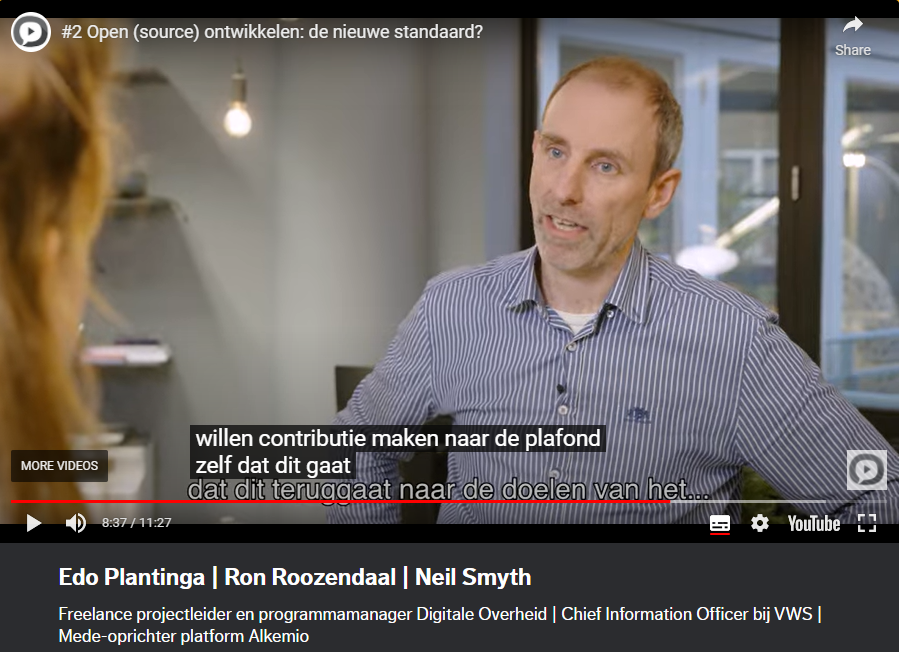

Open source is at the core of Alkemio. Open source is also a key topic for the Dutch government: since 2020 [all new software development must be open source unless there is a clear reason not to](https://www.digitaleoverheid.nl/nieuws/staatssecretaris-knops-geef-broncode-van-overheidssoftware-waar-mogelijk-vrij/#:~:text='Open%20tenzij'&text=Dit%20wil%20zeggen%20dat%20overheden,een%20vertrouwelijke%20werkwijze%20wordt%20geschaad.) (dutch). 

But open source is not widely understood. To help address this, the [Ministerie van Binnenlandse Zaken](https://www.government.nl/ministries/ministry-of-the-interior-and-kingdom-relations) and [Vereniging voor OverheidsManagement](https://www.vom-online.nl/) have created a short [online course](https://omooc.nl/moocs/open-source/) whereby the different aspects, and implications of open source are explored: the code, the community, ways of working with the market, implications for society etc. 

Delighted to have had the chance to contribute (via Neil in his "best" dutch) to this important topic. Our contribution is in [episode 2](https://omooc.nl/inzicht/open-source-de-nieuwe-standaard/). It is in Dutch.  

Digitalization is changing society. We need to decide how we build, own and govern that software.

