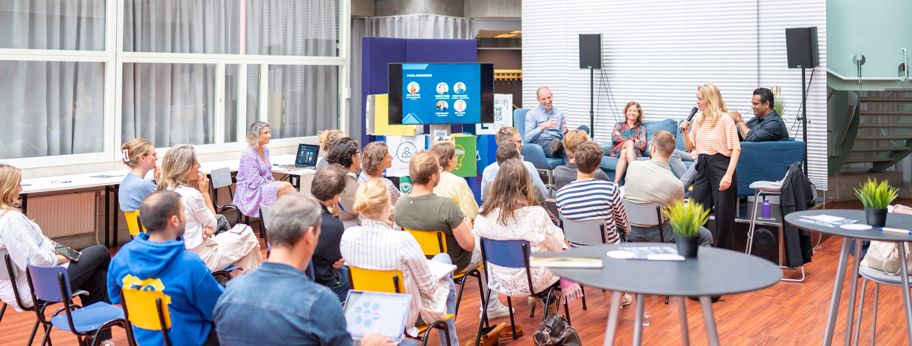
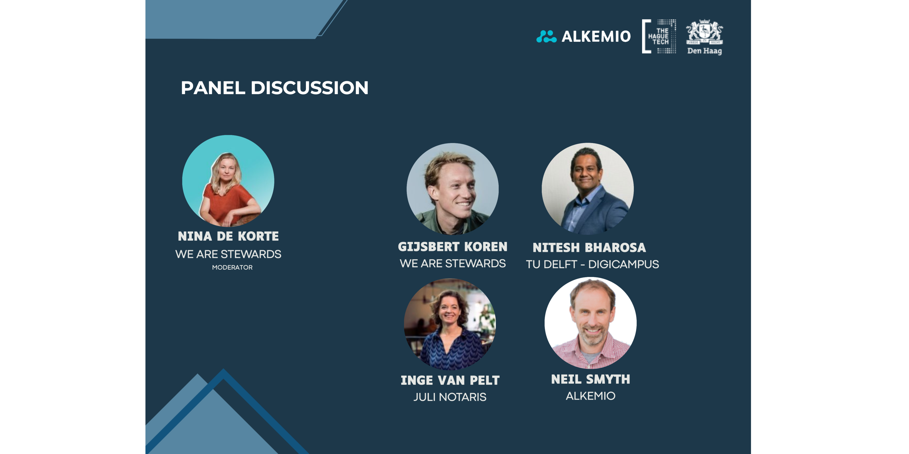
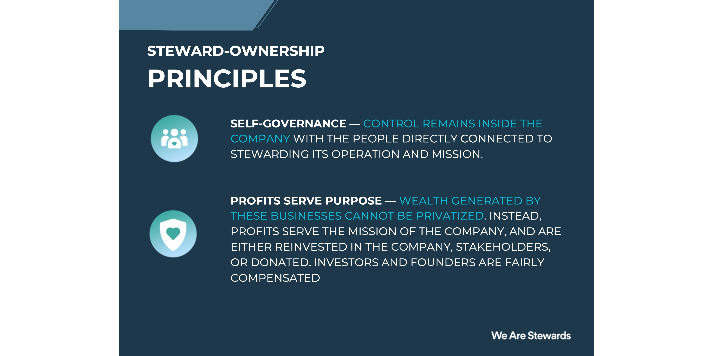

On September 25th, Alkemio, together with the Municipality of The Hague and The Hague Tech hosted a panel discussion around Steward-Ownership. We discussed how a steward-ownership model can empower public and private entities to align their efforts and work together to make greater impact. As it has been recently gaining more popularity, steward-ownership provides a great opportunity to enable an economy that focuses on benefitting society.   
 
The panel was formed by Nitesh Bharosa, the first professor on GovTech and Innovation at TU Delft, as well as Academic Director at Digicampus; Inge van Pelt, from the legal perspective as a Notaris; Gijsbert Koren, initiator of We are Stewards; Neil Smyth from Alkemio; and, last but not least, Nina de Korte from We Are Stewards, as a discussion moderator and expert in steward-ownership. 

This discussion was an opportunity to understand how this model works with in-depth details, its potential, and discussed ways to overcome challenges within the field of steward-ownership and private/public collaboration.

We started the session by first understanding the audience and what their expectations were during the event.  People from the audience also had different backgrounds, ranging from scholars to company and start-ups stakeholders, as well as government representatives. This range of stakeholders reflected on the different areas of knowledge around the subject, interests involved, and gave valuable inputs from multiple points of view.   

## The principles of Steward-Ownership

First, the main principles on the topic were introduced, which set the scene for the panel discussion: 

Then, all parties dived straight into the discussion. One of the identified challenges was the fear of disturbing markets, which often holds back government support. For instance, steward-ownership offers the potential to gather private funds for public goods, but it requires a change in mindset and a raising awareness. Companies shouldn't have to navigate excessive obstacles in their journey towards steward-ownership.  
 
 As organizations mature, finding dedicated stewards becomes essential, and establishing checks and controls is crucial for maintaining transparency and accountability.  
 
It's clear that collaboration and dialogue are key in shaping the future of steward-owned enterprises.  

One of the highlights of our discussion was the inspiring success stories from Denmark, a country that has paved the way for steward-owned companies on a grand scale. Examples include the Carlsberg and the Novo Nordisk, demonstrating how steward-ownership can fuel sustainable growth while making a substantial societal impact.  

Photo by Holland Park Media 2023

## Supporting start-ups on their journey 
 
While these large-scale examples are inspiring, we also explored ways to extend the benefits of steward-ownership to start-ups and smaller businesses. We discussed the importance of providing models that simplify the transition process, challenging the conventional corporate setup as the only standard, and offering guidance to budding steward-owned enterprises. 
 
## Measuring social impact  

In a time when success means more than just economic gains, we raised the questions on how to measure the social impact and commitment. How can we quantify the positive influence of steward-ownership beyond monetary metrics? This conversation highlighted the need to align interests with a broader spectrum of stakeholders and promote a more holistic view of success.
 
## (Some) barriers and solutions 

Our dialogue also delved into the challenges that often hinder government and companies the support for steward-ownership. These blockers include competition law (mededingingsrecht), the time and financial resources required for transitioning, adapting procurement processes, and the cultural barriers that exis, in the Netherlands, but also in different contexts. 
 
As we move towards the end of our event, it became clear that while steward-ownership offers exciting possibilities, it also demands a shift in mindset and concerted efforts from various stakeholders. Our journey continues, and together, we can pave the way for a more sustainable and equitable business landscape.  

Thanks to the participation of experts in their area, each with different expertise and rich backgrounds, and thanks to the active participation of the many people who attended, we can say we are truly positive about current and future prospects for the field, and how it may positively impact society and collaboration. 

Let's continue these discussions on our platform and work towards a more sustainable and responsible business landscape! Go to the [Steward-Ownership Space](https://alkem.io/steward-ownership-nl) at Alkemio.
