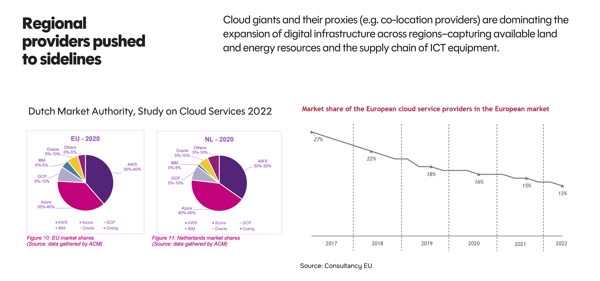
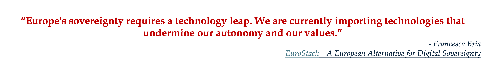
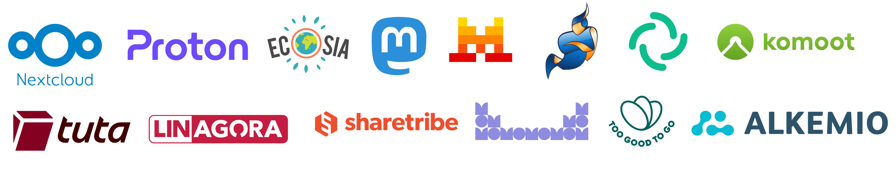
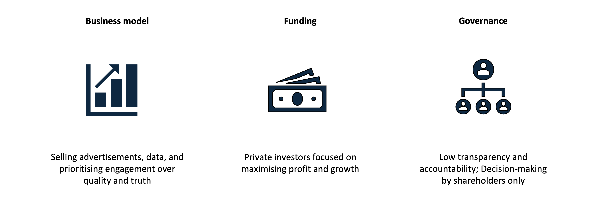
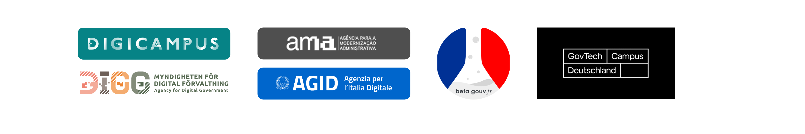

 

If recent technology news leaves you feeling overwhelmed by doom and gloom, you're not alone. There are endless headlines about technology’s increasingly troubled relationship with democracy and its impact on society, amplified by recent political events in the US. But here's the thing: beneath the noisy headlines, something exciting is quietly happening across Europe. 

At Alkemio, we believe it’s time to highlight Europe's hopeful journey towards **digital autonomy for itself and its citizens**. Europe is not just reacting to troubling trends; it is proactively shaping a technology landscape rooted in the public interest, privacy, and fairness. 
 

### First things first: What exactly is digital autonomy? 

Digital autonomy is the ability of individuals, organisations or nations to maintain control over their digital affairs. This includes how we interact with each other, the news we read, how we store and access our information, and how our data is used. 

From a European perspective, such autonomy means control over our critical infrastructure and being self-sufficient, instead of heavy reliance on overseas tech giants. In an era when society is greatly influenced by digital platforms, it includes enabling European values to flourish, with platforms that foster trust and promote a sustainable, inclusive, and democratic society; instead of being subjected to political or profit-maximisation agendas.  

Digital autonomy doesn’t require retreating into the polarising “us versus them” mindset. It is about taking positive actions to protect the interests of citizens while remaining part of a global collaborative technology ecosystem. 

### When the tide goes out... 

We have been happy to enjoy the many benefits of digital platforms in recent decades. However, the reality of the status quo has been revealed dramatically by recent political events. We now see the extent to which society’s digital infrastructure and town squares are controlled by people driven by power, profit and even political agendas.  This power and influence is expanding exponentially with AI, leaving Europe exposed to economic and political leverage from foreign actors. These events have increased awareness of Europe’s dependence on digital platforms over which we have little control. The lack of digital autonomy raises questions about how we got here and what we can/should do about this. If we could rewind 20 years, would we make the same choices?  

Let’s take cloud services as an example. Most European businesses depend heavily on American providers like Microsoft and Amazon for cloud storage. According to research in 2022, American big tech leaders wield a significant portion of the regional market for cloud service providers. European providers have struggled to compete, and their market share was in a state of decline. 

*Graphic credit: Leitmotiv. SDIA Operationalising Values in Digital Infrastructure, 2025.*

 The consequences of this dependency are significant: it puts critical European infrastructure, business data, and even democratic processes at the mercy of foreign companies and regulations. 

Experts like [Bert Hubert](https://berthub.eu/), [Francesca Bria](https://www.francescabria.com/) and [Marietje Schaake](https://en.wikipedia.org/wiki/Marietje_Schaake) have long warned about these risks. They highlight our vulnerability and call urgently for European-built alternatives. 

Thankfully, Europe is already responding, and momentum is building. 

*Source: [EuroStack – A European Alternative for Digital Sovereignty](https://www.bertelsmann-stiftung.de/en/our-projects/reframetech-algorithmen-fuers-gemeinwohl/project-news/eurostack-a-european-alternative-for-digital-sovereignty)*

### Europe isn’t just regulating. It's already building solutions. 

The groundwork has been laid over the last decade, with the initial focus on regulatory efforts and policy proposals. Examples include GDPR and the Digital Markets Act. In addition to regulating foreign big tech firms, these activities have also created vibrant communities across Europe and paved the way for building new solutions.  

Apart from tech giants such as ASML, SAP, Adyen, and Spotify, there are many inspiring European examples which you may not have heard of. They cover all aspects of the tech stack from cloud to search engine, online marketplaces to collective action, and privacy to social networks. 

*Some of the inspiring examples of European technology companies working in the public interest*

Involving citizens in building technology, through public-private collaborations, is a powerful trend in line with European values. Community efforts, like [European Alternatives](https://european-alternatives.eu/), mobilise citizens to switch to products aligned with their values by increasing awareness and encouraging a democratic digital future. 

The efforts to build are complemented through advocacy, lobbying, and research support from organisations such as [Bertelsmann Stiftung](https://www.bertelsmann-stiftung.de/en/home), [Centre for Future Generations (CFG)](https://cfg.eu/), [UCL Institute for Innovation and Public Purpose](https://www.ucl.ac.uk/bartlett/public-purpose), [Centre for European Policy Studies](https://www.ceps.eu/), and [Stiftung Mercator](https://www.stiftung-mercator.de/en/), amongst others. Initiatives like the [EuroStack](https://www.euro-stack.info/) aim to accelerate the building and further development of critical digital infrastructure and services adhering to European standards of privacy, security, and transparency.  

### But can/should Europe just copy Silicon Valley?  

The discussion so far raises a vital question: As Europe pursues digital autonomy, should we just build our versions of companies like Facebook, or can we take valuable learnings from how US big tech has evolved and use these to build European digital champions? 

There are significant consequences, whether intended or not, of the profit-maximising and market-dominance world pursued by the likes of Facebook and Google. 
 
Consider Facebook’s core aspects: 

*Should Europe create technologies that are misaligned?*

Even though these platforms impact our society and our interactions, there is no representation or voice in the decision-making process from users, citizens, or the public sector. These structural choices lead directly to the outcomes we see today such as polarisation, misinformation, lower trust, and a weakened democracy.  

### Europe’s vision: Champions built on values, not just profits 

Digital autonomy for Europe includes enabling digital autonomy for its citizens.  Rather than copy-pasting Silicon Valley, Europe's vision is to create tech companies rooted in European values such as the public interest, privacy, accountability, transparency, and democracy. 

And as more European digital champions emerge, how do we ensure we have a say in whether they can be taken over by others and potentially lose our digital autonomy again? 

This means embracing different business models, funding, and governance structures. This means playing a different game. 

Fortunately, inspiring examples are already emerging across Europe: 

+ **New public-private partnerships**: Initiatives are increasing public sector engagement with citizens and businesses, and strengthening the public sector’s digital capabilities. 

*Many European countries have organisations and initiatives to strengthen the capabilities of the public sector to meet citizen's needs.*

+ **Innovative funding**: Programs such as the [Prototype Fund](https://prototypefund.de/en/) and [Sovereign Tech Fund](https://www.sovereign.tech/programs/fund) support tech innovation with public-interest funding, free from profit-driven pressures that come with venture capital funding, including a focus on interoperability and open source. 

+ **Alternative business models**: Companies like [Proton](https://proton.me/) and [Nextcloud](https://nextcloud.com/) prove tech businesses don't have to depend on invasive ads.    

+ **Ownership and governance**: Companies such as [Voys](https://www.voys.co) and [Alkemio](https://welcome.alkem.io/) show tech companies can choose for steward-ownership with a 3rd party holding a purpose share, which puts the company’s purpose first and protects against a company sale. Companies are also exploring alternate governance models such as cooperatives, collectives, etc. 

### So, what's missing? 

While Europe is taking positive actions, there is much more to do. 

Given the pace of AI development and recent political events, we urgently need greater awareness, bolder investments, stronger regulations, and clear paths for innovation that reflect our collective European ideals. Bridging these gaps will require communities, businesses, policymakers, and citizens to work closely together, driving the European vision forward. 

### Be part of the change! 

This is where you come in. Digital autonomy isn't just about technology. It’s about deciding what kind of future we want. Here's how you can contribute: 

+ **Public and private investors**: Support and finance communities building tech for the public good. Create new funding pools in addition to typical venture capital.

+ **Citizens**: Engage in discussions, contribute to open-source tech, offer feedback on policy proposals, and advocate for a democratic digital future. 

+ **Innovators and entrepreneurs**: Build the next generation of digital services based on European values and consider your ownership and governance.

Europe’s digital autonomy is possible.  [Join us](https://welcome.alkem.io/contact/) in shaping a digital future that serves us all. 